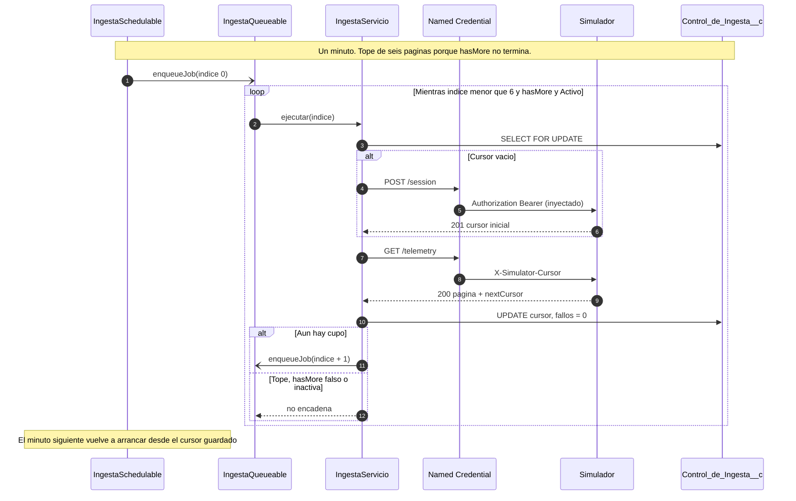
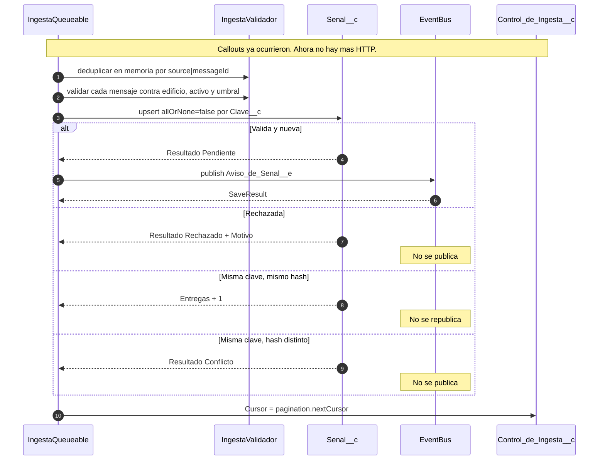
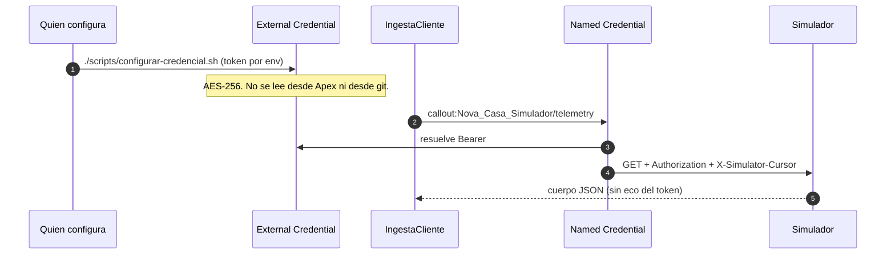
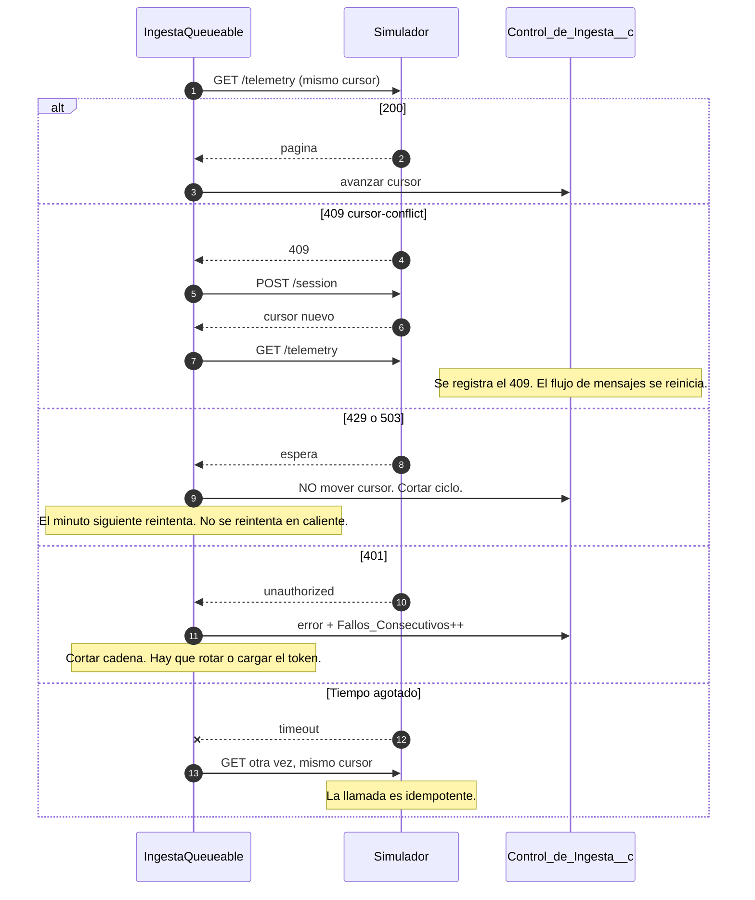

# 02 · Ingesta

Cubre **US-201 · Recibir señales del simulador**.

Este módulo es la zona de Recepción: lo que le pregunta al proveedor si hay novedades,
valida lo que llega y lo convierte en un aviso interno. Termina justo antes de que
empiecen las reglas de negocio.

## El concepto de base

Hay dos formas de que un sistema se entere de que pasó algo en otro. En un modelo de
empuje el productor llama al consumidor cuando tiene novedades: la latencia es mínima
pero el consumidor tiene que estar siempre disponible y expuesto. En un modelo de tirón el
consumidor pregunta cada cierto tiempo: nadie tiene que estar expuesto, pero la latencia
tiene un piso igual al intervalo entre preguntas.

El simulador de Nova Casa es de tirón. No hay forma de que nos avise; expone un endpoint
y hay que ir a buscarlo. Esa es la restricción de la que se derivan casi todas las
decisiones de este módulo, y conviene decirla en voz alta: **el «tiempo real» de este
sistema tiene un piso y ese piso es el intervalo de consulta.**

El segundo concepto es la paginación por cursor. Cuando hay más datos de los que caben en
una respuesta hay que trocearlos. Se puede hacer por desplazamiento —dame los registros
del 200 al 400— o por cursor: el servidor devuelve un testigo opaco que representa «por
dónde ibas» y el cliente lo reenvía en la siguiente llamada. El cursor es superior cuando
el conjunto cambia mientras se recorre, porque no se salta ni repite registros si alguien
inserta en medio. Su precio es que el cliente tiene que guardar ese testigo con cuidado:
perderlo es perder el sitio.

## Cómo funciona la API

### Autenticación

Cabecera `Authorization: Bearer <token>`. El token es del equipo, no de la persona.

Sin token o con un token inválido, la respuesta es la misma, un 401. Está bien que lo sea:
distinguir «no mandaste token» de «tu token no vale» le daría información a quien esté
probando credenciales a ciegas.

### `GET /health`

No requiere token. Devuelve `status`, `service`, `contractVersion` y `time`. Sirve para
comprobar disponibilidad sin gastar credenciales.

### `GET /catalog`

Requiere token. Devuelve los escenarios disponibles, los valores por defecto, el catálogo
de edificios con sus activos y sensores, y una tabla de umbrales de referencia por
medición.

Los valores por defecto observados:

| Clave | Valor | Qué significa |
| --- | --- | --- |
| `scenario` | `MIXED` | El escenario si no se indica otro |
| `batchSize` | 5 | Mensajes por tanda si no se indica otro |
| `maxBatchSize` | 200 | El máximo que acepta |
| `pollAfterMs` | 10000 | Cuánto sugiere esperar entre consultas |
| `sessionTtlSeconds` | 2592000 | Treinta días de vida del cursor |

### `POST /session`

Abre una sesión. Cuerpo:

```json
{
  "scenario": "MIXED",
  "seed": 20260922,
  "batchSize": 50,
  "buildings": ["BLD-BOG-001", "BLD-BAQ-001"]
}
```

Devuelve 201 con el cursor inicial, un bloque `session` que repite los parámetros y añade
`startedAt` y `expiresAt`, y un bloque `usage` con instrucciones.

La `seed` merece una nota. El simulador es determinista: la misma semilla con el mismo
escenario produce exactamente la misma secuencia de mensajes. Eso convierte una demo en
algo reproducible y una prueba en algo que se puede repetir, que es justo lo que pide
US-202 cuando habla de resultados verificables.

### `GET /telemetry`

Requiere el token y la cabecera `X-Simulator-Cursor`. Acepta `?limit=` para pedir menos
mensajes que el `batchSize` de la sesión. Devuelve el sobre descrito en el
[módulo 01](01-contrato-del-mensaje.md).

Reenviar el mismo cursor devuelve la misma página: la llamada es idempotente. Eso es
importante porque significa que un fallo después de leer pero antes de guardar el avance
no pierde datos, solo los repite, y la deduplicación se encarga del resto.

### Los errores

Todos siguen el formato RFC 9457, con `type`, `title`, `status` y `detail`. Verificados
contra la API:

| Situación | Código | `type` |
| --- | --- | --- |
| Token ausente o inválido | 401 | `unauthorized` |
| Falta la cabecera `X-Simulator-Cursor` | 400 | `invalid-request` |
| `batchSize` fuera del rango 1–200 | 400 | `invalid-request` |
| Escenario no reconocido | 400 | `invalid-scenario` |
| Cursor alterado, expirado o incompatible | 409 | `cursor-conflict` |
| Demasiadas consultas | 429 | documentado, no reproducido |
| Servicio no disponible | 503 | documentado, no reproducido |

## Dónde viven las credenciales

### El concepto

Un secreto embebido en código o en configuración de datos tiene tres problemas. Queda en
el control de versiones para siempre, aunque después se borre. Es visible para cualquiera
que pueda leer el metadato. Y rotarlo obliga a desplegar.

Salesforce resuelve esto con dos piezas que conviene no confundir. La **External
Credential** guarda el secreto y describe cómo se construye la cabecera de autenticación;
el secreto queda cifrado y no es legible desde Apex. La **Named Credential** apunta a una
URL y referencia una External Credential; desde Apex se invoca por nombre lógico y la
plataforma inyecta la cabecera. El código nunca ve el token.

### La decisión

**Una External Credential con protocolo `Custom`, un parámetro de autenticación de tipo
principal que guarda el token, y una Named Credential que apunta a la URL base del
simulador.** La cabecera se declara como `Authorization: Bearer {!$Credential.<nombre>}`.

En Apex la llamada queda así, sin rastro del secreto:

```apex
HttpRequest peticion = new HttpRequest();
peticion.setEndpoint('callout:Nova_Casa_Simulador/telemetry?limit=' + limite);
peticion.setMethod('GET');
peticion.setHeader('X-Simulator-Cursor', cursor);
peticion.setHeader('Accept', 'application/json');
```

El acceso a la External Credential se concede por conjunto de permisos, y ese conjunto se
asigna **solo al usuario de integración**, no a los operadores. Es la primera de las tres
fronteras de seguridad que describe el [módulo 10](10-seguridad-y-accesos.md).

Queda explícitamente prohibido, y conviene que esté escrito: el token no se guarda en
Apex, ni en Custom Metadata, ni en Custom Settings, ni en un archivo del repositorio, ni
aparece en capturas de pantalla ni en registros de depuración.

## Dónde se guarda el cursor

### El problema del tamaño

El cursor es una cadena firmada en base 64. Los observados rondan los 290 caracteres:

```
eyJ2IjoiMSIsInRlYW0iOiJlcXVpcG8tNCIsInNlZWQiOjIwMjYwOTIyLCJzY2VuYXJpbyI6IkNBTUVS
QV9PVVRBR0UiLCJidWlsZGluZ3MiOlsiQkxELUJPRy0wMDEiLCJCTEQtQkFRLTAwMSJdLCJiYXRjaFNp
emUiOjEwLCJzdGFydGVkQXQiOiIyMDI2LTA5LTIyVDIxOjUxOjQ5LjM1OFoiLCJsYXN0U2VxdWVuY2Ui
OjEwLCJleHAiOjE3OTI3MDU5MDkzNTh9.JzzntU3KvFtsAMh2BHNJeB4oliZ-KwuZazbSkmFV0-o
```

Eso descarta las Custom Settings, cuyos campos de texto llegan a 255 caracteres, y
descarta un campo `Text` normal por la misma razón. Hay que usar un `Long Text Area`, y
eso obliga a que el contenedor sea un objeto personalizado.

### La decisión

**Un objeto `Control_de_Ingesta__c` con un único registro activo**, que guarda el estado
completo del ciclo de ingesta:

| Campo | Tipo | Para qué |
| --- | --- | --- |
| `Cursor__c` | Long Text Area (1000) | El testigo de por dónde vamos |
| `Escenario__c` | Picklist | El escenario de la sesión abierta |
| `Semilla__c` | Number | La semilla, para poder reproducir |
| `Tamano_Tanda__c` | Number | El `batchSize` acordado con el simulador |
| `Sesion_Iniciada__c` | Datetime | `startedAt` devuelto por el simulador |
| `Sesion_Expira__c` | Datetime | `expiresAt` devuelto por el simulador |
| `Ultima_Consulta_Exitosa__c` | Datetime | Alimenta el aviso de consulta atrasada |
| `Ultimo_Error__c` | Text (255) | El `detail` del último problema |
| `Fallos_Consecutivos__c` | Number | Corta la cadena si algo va mal de forma persistente |
| `Activo__c` | Checkbox | Permite detener la ingesta sin desplegar |
| `Paginas_Procesadas__c` | Number | Diagnóstico y tope por ciclo |

El registro se lee al inicio de cada ciclo y se escribe al final. Se bloquea con
`FOR UPDATE` al leerlo, de modo que dos ejecuciones solapadas no puedan avanzar el cursor
a la vez y perderse una página entre ambas.

## La cadencia

### El problema

La API sugiere consultar cada diez segundos. Apex programado tiene un mínimo de un minuto,
y Apex no puede dormir: no hay forma de esperar diez segundos dentro de una transacción.

Hay un segundo problema, más sutil, que solo se ve al llamar a la API de verdad. En los
escenarios continuos `hasMore` **siempre vale `true`**: el flujo no termina nunca. Un
bucle escrito como «sigue pidiendo páginas mientras haya más» no termina jamás y agota los
límites de la plataforma. Solo `QA_200` devolvió `hasMore: false`, porque es un escenario
finito de exactamente doscientos mensajes.

### Las alternativas

Apex programado cada minuto con una sola página por ejecución es lo más simple y lo más
fácil de operar, pero deja la latencia en un minuto cuando la API ofrece diez segundos.
Un botón manual para la demo evita todo el problema pero no demuestra nada sobre el
comportamiento continuo del sistema, que es parte de lo que se pide.

### La decisión

**Una cadena de `Queueable` con tope de páginas por ciclo, reprogramada cada minuto por un
`Schedulable`.** Concretamente:

1. Un `Schedulable` se ejecuta cada minuto y encola el primer eslabón de la cadena.
2. Cada eslabón pide **una** página, la procesa, guarda el cursor y decide si continuar.
3. Continúa encolando el siguiente eslabón mientras se cumplan a la vez tres condiciones:
   quedan páginas por debajo del tope del ciclo, `hasMore` es verdadero, y no se ha
   agotado el presupuesto de llamadas de la transacción.
4. El tope por ciclo es **seis páginas**, que es el número de ventanas de diez segundos que
   caben en un minuto. Se guarda como constante nombrada.

Esto aproxima la cadencia de diez segundos sin bucle infinito y sin depender de que Apex
pueda esperar. Cada eslabón es una transacción independiente, así que el presupuesto de
llamadas externas y de operaciones de base de datos se renueva en cada uno.

La cadena se corta, además de por el tope, si `Activo__c` está desmarcado o si
`Fallos_Consecutivos__c` supera tres.

### El riesgo que esto deja abierto

Una cadena que se reprograma a sí misma tiene una falla característica: si un eslabón
muere sin control, la cadena se detiene y **nadie se entera**. El sistema sigue pareciendo
sano mientras deja de recibir datos.

La defensa es `Ultima_Consulta_Exitosa__c`. El componente del operador muestra un aviso
visible cuando esa fecha es demasiado antigua. No es una alarma, pero es la diferencia
entre un operador que sabe que está mirando datos viejos y uno que no.

Que el `Schedulable` corra cada minuto es parte de la misma defensa: aunque la cadena se
rompa, el siguiente minuto la vuelve a arrancar desde el cursor guardado.

## El tratamiento de los errores

| Código | Qué hacemos | Por qué |
| --- | --- | --- |
| 200 | Procesar la página y avanzar el cursor | — |
| 400 por cabecera ausente | Abrir sesión nueva y reintentar una vez | El cursor se perdió; es recuperable |
| 400 por parámetros | Cortar la cadena y registrar el error | Es un fallo de configuración nuestro |
| 401 | Cortar la cadena y registrar el error | El token caducó o cambió. Requiere intervención |
| 409 | Abrir sesión nueva, registrar el hecho y continuar | El cursor ya no sirve |
| 429 | Cortar el ciclo, no el `Schedulable` | El siguiente minuto reintenta. Es la espera |
| 503 | Cortar el ciclo, no el `Schedulable` | Igual que el anterior |
| Tiempo agotado | Reintentar la misma página una vez, con el mismo cursor | La llamada es idempotente |

El caso 409 merece una aclaración, porque tiene una consecuencia que no es obvia. Abrir
una sesión nueva **reinicia el flujo de mensajes desde el principio**: el simulador
vuelve a emitir `msg_000001`. Eso no corrompe nada, porque la clave del mensaje es la
misma y la deduplicación los reconoce como reenvíos, pero sí infla el contador de entregas
y llena la bitácora de duplicados. Por eso el 409 se registra explícitamente en
`Ultimo_Error__c` en lugar de tratarse como un caso rutinario.

El 429 no se reintenta dentro del mismo ciclo. Reintentar de inmediato ante una respuesta
que dice «vas demasiado rápido» es exactamente lo que no hay que hacer. Cortar el ciclo y
dejar que el siguiente minuto lo retome es, en la práctica, una espera de un minuto.

## De la página al aviso interno

### El concepto

Un evento de plataforma es un mensaje que se publica en un bus y que uno o varios
suscriptores reciben de forma asíncrona. Desacopla al productor del consumidor: quien
publica no espera a que nadie procese, y si el procesamiento falla, la publicación no se
deshace.

Ese desacople es la razón de existir de la pieza. Permite que la recepción termine su
trabajo rápido —leer, validar, publicar— y que el procesamiento, que es donde viven las
reglas y donde puede fallar cualquier cosa, ocurra en otra transacción.

### La decisión

**Un único evento `Aviso_de_Senal__e`, con un campo que indica el tipo de mensaje.** Se
descartó tener un evento por tipo porque el alcance formativo del sprint pide un solo
evento de plataforma y porque duplicar la definición duplicaría también el suscriptor.

El precio hay que decirlo: como el mismo evento sirve para lecturas y para conectividad,
**no puede declarar obligatorio ningún campo que no esté presente en los dos tipos**. Un
aviso de conectividad no trae valor ni unidad. La obligatoriedad, por tanto, se comprueba
en código y no en la definición del evento, y eso significa que un error de contrato no
salta solo: hay que probarlo explícitamente. Está en el [plan de pruebas](12-plan-de-pruebas.md).

### Qué se publica, y qué no

Solo se publican los mensajes que **pasaron todas las validaciones**. Un mensaje rechazado
se guarda en la bitácora con su motivo y ahí termina su recorrido: no se publica, porque
publicar algo que ya sabemos que no se puede procesar solo añade ruido al bus.

Un mensaje reconocido como duplicado tampoco se publica. Se incrementa el contador de
entregas de la señal existente y se acabó. Esta es la barrera más importante contra el
reprocesamiento y está antes del bus, no después.

### El orden de las operaciones

El orden importa, y no es el intuitivo. En cada página:

1. Se deduplica en memoria y se validan todos los mensajes.
2. Se hace `upsert` de las señales por `Clave__c`, con `allOrNone` en falso, marcando las
   válidas como **pendientes** y las rechazadas con su motivo y su resultado final.
3. Se publican los eventos **solo de las señales que se guardaron correctamente**.
4. Se avanza el cursor.

Guardar antes de publicar es deliberado. Si se publicara primero y el guardado fallara,
existiría un aviso en el bus sin señal que lo respalde, y el procesamiento no tendría
dónde escribir su resultado. Al revés, si se guarda y falla la publicación, la señal queda
como pendiente, que es exactamente lo que es, y se ve en la bitácora.

Esto es también lo que responde el criterio de US-201 sobre distinguir una publicación
aceptada de una señal efectivamente procesada. **Pendiente** significa que llegó y se
publicó; **aplicado** significa que el procesamiento terminó. Son dos estados distintos
porque son dos momentos distintos, y entre ellos puede pasar cualquier cosa.

### El límite de publicación

`EventBus.publish` acepta una lista, pero hay un techo de eventos publicados por
transacción. Con páginas de hasta 200 mensajes no se alcanza, pero la publicación se hace
igualmente en una sola llamada con la lista completa y se revisan los `SaveResult` uno a
uno: los que fallen dejan su señal en pendiente con el motivo registrado, en lugar de
perderse en silencio.

## La siembra del catálogo

`GET /catalog` devuelve los dos edificios y sus diez activos con sus códigos, tipos,
sensores, mediciones y unidades. Eso responde Q-06: no hace falta que el proceso de
ingesta cree registros cuando ve un activo desconocido.

**Decisión: los edificios y activos se siembran antes de la demo desde el catálogo, y un
mensaje de un activo desconocido se rechaza con motivo reintentable.**

Crear registros desde la ingesta tiene un problema que no compensa: un error de tipografía
en el código de un activo generaría un registro fantasma, y nadie se daría cuenta porque
el mensaje se habría procesado «correctamente». Rechazar con motivo reintentable deja el
problema visible y recuperable. El escenario `INVALID_DATA` incluye un
`AST-UNKNOWN-0001` justamente para ejercitar este camino.

La siembra se materializa como un script de datos en el repositorio, no como una carga
manual, para que cualquiera pueda reconstruir el entorno desde cero. El comando es
`./scripts/sembrar-catalogo.sh`. Qué queda sembrado y con qué códigos está en
[`estado.md`](estado.md).

## Cómo se ejecuta

Las credenciales se despliegan vacías de secreto. El token se cifra en la org:

```bash
export NOVA_CASA_SIMULADOR_TOKEN='...'   # nunca se commitea
./scripts/configurar-credencial.sh novacasa2
./scripts/sembrar-catalogo.sh novacasa2
sf apex run -o novacasa2 -f scripts/apex/sembrar-control-ingesta.apex
./scripts/ejecutar-ingesta.sh novacasa2
```

La cadencia continua es `./scripts/programar-ingesta.sh novacasa2`. Se cancela con
`--abortar`. Lo que queda en `Senal__c` y en `Control_de_Ingesta__c` después de una
página está en [`estado.md`](estado.md).

## Diagramas de secuencia

Estos diagramas son el mapa de US-201. El Mermaid se ve en GitHub; el ASCII está
para quien lea el documento en un terminal.

### 1. Un ciclo: del minuto a las seis páginas

#### Mermaid



#### ASCII

```text
IngestaSchedulable          IngestaQueueable           Simulador         Control__c
        |                          |                       |                 |
        |  enqueue indice=0        |                       |                 |
        |------------------------->|                       |                 |
        |                          |  FOR UPDATE           |                 |
        |                          |---------------------------------------->|
        |                          |  POST /session        |                 |
        |                          |---------------------->|                 |
        |                          |  201 cursor           |                 |
        |                          |<----------------------|                 |
        |                          |  GET /telemetry       |                 |
        |                          |---------------------->|                 |
        |                          |  200 pagina           |                 |
        |                          |<----------------------|                 |
        |                          |  guardar nextCursor                     |
        |                          |---------------------------------------->|
        |                          |  enqueue indice+1     |                 |
        |                          |-----+                 |                 |
        |                          |     | (hasta 6)       |                 |
        |                          |<----+                 |                 |
```

#### Notas

- Cada eslabon es una transaccion: callout, DML y tope de eventos se renuevan.
- `hasMore` en MIXED es siempre verdadero; el tope de seis es lo que evita el bucle infinito.
- Si un eslabon muere, el Schedulable del minuto siguiente retoma el cursor guardado.

### 2. Una pagina: validar, guardar, publicar, avanzar

#### Mermaid



#### ASCII

```text
  pagina JSON
       |
       v
  [deduplicar en memoria] ---- clave repetida ----> Entregas++ / Conflicto
       |
       v
  [validar uno a uno] ------ motivo ----> Senal Rechazado (no evento)
       |
       v
  upsert Senal.Clave__c  (allOrNone = false)
       |
       +--> Pendiente nueva ---- EventBus.publish(Aviso_de_Senal__e)
       |
       v
  Control.Cursor = nextCursor
```

#### Notas

- Guardar antes de publicar evita un aviso en el bus sin senal que lo respalde.
- Pendiente significa publicado, no procesado. `Fecha_Procesamiento__c` queda vacia.
- Una clave repetida en la misma pagina no se manda al upsert: si se mandara, fallaria entero.

### 3. Credenciales: el token no entra a Apex

#### Mermaid



#### ASCII

```text
  env TOKEN  -->  script  -->  External Credential (cifrada)
                                      |
                                      v
  Apex  -->  callout:Nova_Casa_Simulador  -->  simulador
             (sin el secreto en el codigo)
```

#### Notas

- Prohibido: Apex, Custom Metadata, Custom Settings, archivos del repo, capturas.
- El acceso al principal `Nova_Casa_Simulador-Equipo` va en permission set. Issue #14 lo mueve al usuario de integracion.

### 4. Errores HTTP

#### Mermaid



#### ASCII

```text
  200  -> procesar, avanzar cursor, tal vez encadenar
  409  -> POST /session, registrar, continuar (msg_000001 otra vez; deduplica)
  429  -> cortar ciclo, cursor intacto, el minuto siguiente reintenta
  503  -> igual que 429
  401  -> cortar cadena, contar fallo, pedir token
  timeout -> un reintento con el mismo cursor; si falla, cursor intacto
```

#### Notas

- Reenviar el mismo cursor devuelve la misma pagina: por eso el timeout no pierde datos.
- El 429 no se reintenta dentro del ciclo: reintentar al instante es lo que la API acaba de prohibir.
