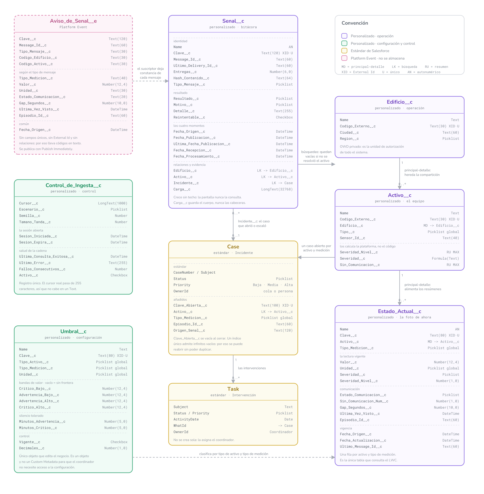

# Modelo de datos, a nivel de campo



Tambien en [PDF vectorial](modelo-de-datos.pdf), que es el formato para imprimir o
ampliar sin perder nitidez.

## Que es esto y que no

Este diagrama es la **referencia de construccion**: cada objeto con cada campo, su tipo y
sus marcas. Es lo que se sigue al crear los objetos en la organizacion.

No sustituye a [`../03-modelo-de-datos.md`](../03-modelo-de-datos.md), que explica **por
que** el modelo es asi. El diagrama dice que `Activo__c.Edificio__c` es una relacion
principal-detalle; el documento dice por que no es una busqueda y que se habria perdido.

Tampoco sustituye al diagrama del Entregable 4, que muestra los ocho conceptos y como se
relacionan sin entrar en campos. Ese es el que se ensena a quien quiere entender el
sistema; este es el que se usa para construirlo.

## Como leerlo

Las abreviaturas de la columna derecha de cada caja:

| Marca | Significa |
| --- | --- |
| `MD` | Relacion principal-detalle. El hijo hereda permisos y alimenta resumenes |
| `LK` | Relacion de busqueda. Puede quedar vacia |
| `RU` | Campo de resumen automatico, lo recalcula la plataforma |
| `XID` | External Id: habilita el `upsert` por ese campo |
| `U` | Unique: la restriccion la impone la base de datos |
| `AN` | Autonumerico |

El color dice que clase de cosa es cada pieza, y esa distincion tiene consecuencias
practicas: lo verde lo edita una persona del negocio sin desplegar codigo, lo ambar viene
de fabrica con colas e informes que no hay que construir, y lo rosa no existe en ninguna
tabla.

## Los cinco detalles que el diagrama hace visibles

**`Severidad_Nivel__c` aparece dos veces, como numero.** En `Estado_Actual__c` es un
`Number(1,0)` que el codigo escribe con 0, 1 o 2, y en `Activo__c` es un resumen `MAX`
sobre el anterior. Es asi porque **un resumen automatico solo opera sobre numeros**, no
sobre listas desplegables. La fórmula `Severidad__c` traduce el numero a texto al leer.

**`Senal__c` apunta a edificio y activo con busquedas, no con principal-detalle.** Una
senal rechazada por activo desconocido no tiene activo al que colgarse, y es justo la que
mas interesa registrar. El precio es que la bitacora no hereda permisos y hay que
protegerla por su cuenta.

**`Cursor__c` es un `LongText`, no un `Text`.** Los cursores reales del simulador pasan de
255 caracteres, que es el maximo de un campo de texto. Ese solo dato descarta guardar el
control de ingesta en un Custom Setting.

**`Clave_Abierta__c` es `Unique` y se vacia al cerrar el caso.** Un indice unico admite
tantos valores vacios como haga falta, asi que la misma restriccion impide dos incidentes
abiertos para el mismo problema y permite abrir uno nuevo cuando reaparece.

**`Aviso_de_Senal__e` no tiene ni un campo unico ni una relacion.** Los eventos de
plataforma no los admiten, y por eso lleva los codigos externos en texto y toda la
proteccion contra duplicados vive en `Senal__c.Clave__c`.

## Como regenerarlo

```bash
cd generadores
PYTHONPATH="../.pylibs:." python3 render_modelo_detallado.py
```

La fuente esta en `generadores/modelo_detallado.py`, en el mismo estilo que los diagramas
de los entregables. **Si cambia el modelo, se cambia primero en
[`../03-modelo-de-datos.md`](../03-modelo-de-datos.md) y despues aqui**, nunca al
contrario: el documento es la fuente de verdad y el diagrama es su retrato.
